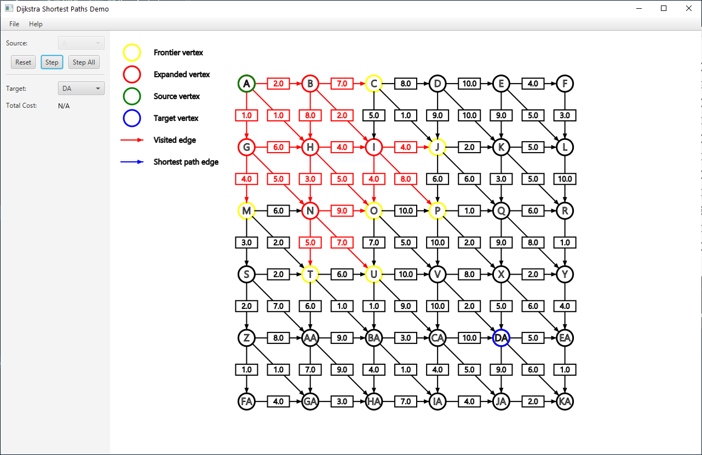

# DSP-DEMO

A dead-simple demo of the shortest paths algorithm by Edsger W. Dijkstra. 

Use the controls on the left to select a starting point, and run the algorithm either by individual
steps or all at once. When you're done, you can reset and try again!

Inspect the generated shortest paths by selecting a target node on the left, or by clicking the
desired node in the view.

You can import and run the algorithm on your own graphs, defined in a subset of the GraphML format,
by selecting the 'Open...' option in the file menu. 

## GraphML Import
Although GraphML is a very flexible format, the importer currently supports only directed graphs without 
self-referencing edges. You can find an example of an importable file in the folder ``graphml-examples``, with
all required attributes specified. Here's a quick description of each:

### Vertex Attributes
- "x": X-coordinate of the specified vertex. Recommended range is [-1, 1], nodes outside may not be displayed.
- "y": Y-coordinate of the specified vertex. Recommended range is [-1, 1], nodes outside may not be displayed.
- "label": Vertex label as displayed in the application. I recommend using single letters or numbers here, as longer
labels will only expand beyond the bounds of circular vertex graphic in the view.

### Edge Attributes
- "weight": Edge-weight as per the shortest paths algorithm. I recommend using shorter numbers, as longer numbers will
expand beyond the bounds of the edge graphics.

## Installation

1. ``git clone git@github.com:mhen/dsp-demo.git``
2. ``cd dsp-demo``
3. ``mvn package``
4. ``java --enable-preview -jar target/dsp-demo.jar``
